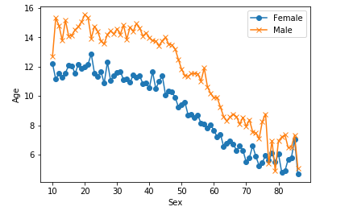
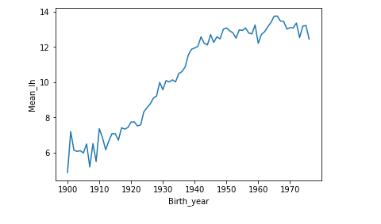
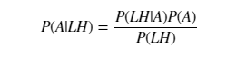
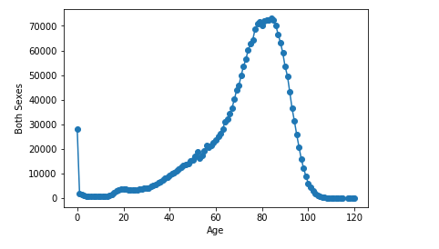
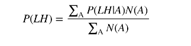
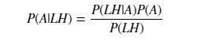
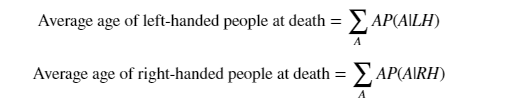

# Do-Left-handed-People-Really-Die-Young

## 📁Presentation de projet:

## 📌 Introduction : 

###### 
Barack Obama est gaucher. Il en va de même pour Bill Gates et Oprah Winfrey ; tout comme Babe Ruth et Marie Curie. Une étude de 1991 a rapporté que les gauchers meurent en moyenne neuf ans plus tôt que les droitiers. Neuf ans! Cela pourrait-il être vrai? 

-------

## 📌 Les étapes du projet
###### 1. Où sont les vieux gauchers ?
###### 2. Taux de gaucher au fil du temps
###### 3. Application de la règle de Bayes
###### 4. Quand les gens meurent-ils normalement ?
###### 5. La probabilité globale d'être gaucher
###### 6. Tout mettre ensemble : mourir en étant gaucher (i)
###### 7. Tout mettre ensemble : mourir en étant gaucher (ii)
###### 8. Tracer les distributions des probabilités conditionnelles
###### 9. Moment de vérité : âge des gauchers et des droitiers au décès
###### 10. Commentaires finaux

## 📌 Analyse
##### 🔖 Nous apprendrons à travailler avec les données en utilisant des bibliothèques libres populaires disponibles en Python : `numby` `matplotlib` et `pandas` 
	✔️import pandas as pd
	✔️import matplotlib.pyplot as plt
	✔️import numpy as np

##### Lecture des données du prix Nobel
######  📄 data_url_1 = "https://gist.githubusercontent.com/mbonsma/8da0990b71ba9a09f7de395574e54df1/raw/aec88b30af87fad8d45da7e774223f91dad09e88/lh_data.csv"

###### lefthanded_data = pd.read_csv(data_url_1)

    |       |   Age   |   Male   |      Female      |  Birth_year  |   Mean_lh |
    |  0    |    10   | 12.7176  |      12.198      |     1976     |   12.4578 |
    |  1    |    11   | 15.3188  |      11.1448     |     1975     |   13.2318 |
    |  2    |    12   | 14.8083  |      11.5492     |     1974     |   13.1788 |
    |  3    |    13   | 13.7937  |      11.2764     |     1973     |   12.5351 |
    |  4    |    14   | 15.1563  |      11.5729     |     1972     |   13.3646 |

-------

#### 📊 taux de gauchers chez les hommes et les femmes en fonction de l'âge

------
#### 📊les taux de gaucher en fonction de l'année de naissance, et moyenne sur homme et femme pour obtenir un taux unique pour les deux sexes.

######Puisque l'étude a été réalisée en 1986, les données après cette conversion seront le pourcentage de personnes vivantes en 1986 qui sont gauchers en fonction de l'année de leur naissance.

-------

#### la théorème utilisée
La probabilité de mourir à un certain âge sachant qu'on est gaucher n'est pas égale à la probabilité d'être gaucher sachant qu'on est mort à un certain âge. Cette inégalité est la raison pour laquelle nous avons besoin du théorème de Bayes, une déclaration sur la probabilité conditionnelle qui nous permet de mettre à jour nos croyances après avoir vu des preuves.

On veut calculer la probabilité de mourir à l'âge A sachant que l'on est gaucher. Écrivons ceci en sténographie comme P(A | LH). On veut aussi la même quantité pour les droitiers : P(A | RH).

###### P(LH | A) est la probabilité que vous soyez gaucher étant donné que vous êtes décédé à l'âge A. 
###### P(A) est la probabilité globale de mourir à l'âge A.
###### P(LH) est la probabilité globale d'être gaucher. 
-------
#### Quand les gens meurent-ils normalement ?

Pour estimer la probabilité de vivre jusqu'à un âge A, nous pouvons utiliser des données indiquant le nombre de personnes décédées au cours d'une année donnée et leur âge pour créer une distribution des âges de décès.

-------
#### Probabilité globale d'être gaucher si vous décédez au cours de l'année d'étude = 0.07766387615350638
######en utilisant cette théorème 

-------
#### La probabilité globale d'avoir un "age_of_death" particulier étant donné que vous êtes gaucher

-------
#### 📊 pour conclure
en calculant la moyenne de ces distributions de probabilité de la même manière que nous avons calculé P(LH) plus tôt, en pondérant la distribution de probabilité par âge et en additionnant le résultat.
#####âge des gauchers et des droitiers au décès

######Âge moyen des gauchers67,24503662801027
######Âge moyen des droitiers72,79171936526477
######La différence d'âge moyen est de 5,5 ans..
